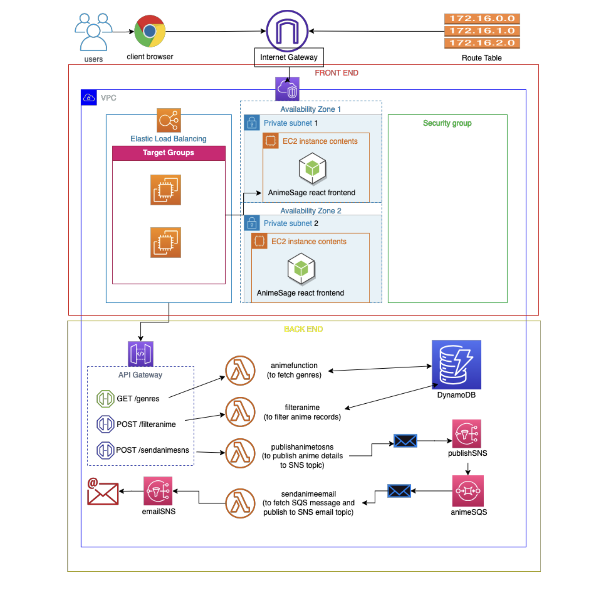

!!!abstract "What's AnimeSage?"
    **AnimeSage** is a sleek, intuitive anime recommendation app designed for anime enthusiasts looking to discover new titles based on their preferences. Whether you're a seasoned otaku or a newbie, AnimeSage helps you find your next anime series easily with personalized recommendations.
    AnimeSage is not just another anime app. It’s a **personalized experience** that leverages the power of AWS to deliver fast, secure, and scalable anime recommendations. Whether you're looking for the next big series or a hidden gem, AnimeSage will help you find it.

---

## Features

???Example "Why AnimeSage?"
    - [x] **Personalized Recommendations**  
    Filter through a vast library of anime based on your preferences such as *Aired date*, *Episodes*, *Popularity*, *Score*, *Ranked*, and *Genres*.

    - [x] **Dynamically Populated Genres**  
    Access the most up-to-date genres dynamically sourced from the database.

    - [x] **Email Integration**  
    Get detailed information about any anime directly in your inbox with a single click.

    - [x] **Visually Appealing Interface**  
    Enjoy an interactive UI with **cards** and **grids** to quickly scan and find anime that match your tastes.

    - [x] **AWS-Powered Backend**  
    Built on AWS services like Lambda, DynamoDB, SNS, and SQS, ensuring scalability, security, and high availability.

## Architecture
---
!!! tip "Serverless architecture"
    AnimeSage utilizes a **serverless architecture** for optimal performance, cost-effectiveness, and scalability, powered by AWS.

{ align=left }

---
### **AWS Services Used**  

| Service | Purpose |
|---------|---------|
| **AWS Lambda** | Stateless API requests and data processing |
| **AWS EC2** | Hosting the frontend React app |
| **AWS DynamoDB** | NoSQL database for storing and querying anime data |
| **AWS SNS** | Sending notifications and anime details via email |
| **AWS SQS** | Decoupling components for asynchronous messaging |
| **AWS VPC** | Secure networking between services |
| **AWS Elastic Load Balancer** | Balancing traffic for high availability |
| **AWS Internet Gateway** | Enabling internet connectivity for EC2 instances and other resources in VPC |
| **AWS API Gateway** | Creating and managing RESTful APIs for Lambda functions |
| **AWS Security Groups** | Controlling inbound and outbound traffic to EC2 instances and other services |

---

### **Deployment Model**

The app leverages the **public cloud** deployment model, ensuring that all services are hosted and managed in the cloud, making AnimeSage globally accessible, cost-effective, and scalable.

---

## **User Flow**

1. **User Input**: The user inputs preferences such as genres, scores, and aired dates.
2. **Backend Processing**: AWS Lambda processes these inputs and queries the **DynamoDB** database.
3. **Anime Recommendations**: The system presents personalized anime recommendations in **cards** and **grids**.
4. **Email Integration**: Users can email themselves the anime details with a click of a button.

---

## **Security Features**

- **SSL/TLS Encryption**: Ensures that all data exchanged between frontend and backend is securely transmitted.
- **DynamoDB Encryption**: All stored data is encrypted at rest, using AWS-managed keys for added security.
- **IAM Policies**: Restrict access to resources, adhering to the principle of least privilege.

---

## **Cost Analysis**

### Upfront Costs

- **AWS Resources**: EC2 instances, Lambda functions, DynamoDB, SNS, and SQS.
- **Domain and SSL Certificates**: For securing the web application.

### Ongoing Operational Costs

| Service | Cost Type |
|---------|-----------|
| **Lambda** | Pay-as-you-go based on requests and compute time |
| **DynamoDB** | Based on read/write capacity units |
| **SNS & SQS** | Based on the number of messages |

---

### **Get Started**
!!!warning "Live coming soon!"
    The app will be hosted and will be alive soom, so stay tuned!

- Visit the app at [AnimeSage](https://anime-sage.com)
- Enter your anime preferences and receive personalized recommendations!
- Sign up to receive anime details via email.

---

## **Technologies Used**

- **Frontend**: React
- **Backend**: Node.js (Lambda Functions)
- **Database**: AWS DynamoDB
- **Email**: AWS SNS and SQS
- **Cloud Infrastructure**: AWS (Lambda, EC2, DynamoDB, SNS, SQS, VPC)

---

## **Installation and Setup**

!!!tip "Try it out!"
    Follow the steps to run it locally!

1. **Clone the repository**:  
   `git clone https://github.com/your-username/animesage.git`
   
2. **Set up the environment**:  
   Install dependencies via `npm install` for React and set up AWS CLI for backend services.

3. **Deploy to AWS**:  
   Use AWS CLI or AWS CloudFormation to set up resources. Make sure to configure **API Gateway**, **Lambda**, **DynamoDB**, and **SNS**.

4. **Run the Application**:  
   Once everything is set up, run `npm start` to start the React app locally.

---

## **Contributing**

We welcome contributions to AnimeSage! Please fork the repository, create a feature branch, and submit a pull request.

---

## **Contact**

!!!question "Any doubts?"
    Feel free to reach out if you have any suggestions, doubt's or wish to know more! Thanks!

---

